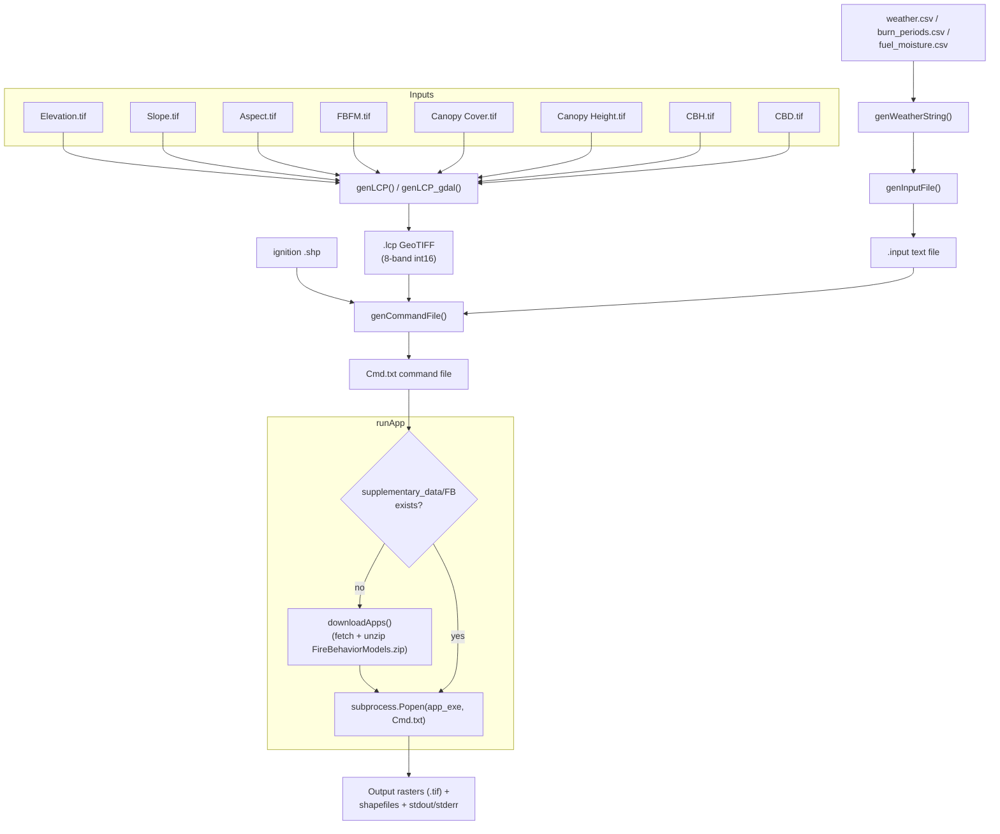

# Codebase Reference

Snapshot from exploration on 2026-09-23. Update if the shape of the code changes materially.

## 1. Architecture overview

Single-module Python library that automates Missoula Fire Sciences Lab CLI fire-behavior models
(FlamMap, MTT, TOM, FARSITE) on Windows. There is no app framework, no API server, no CLI arg
parser — it's a library of functions called from small driver scripts, plus a `__main__` smoke test.

Everything is file-based hand-off: raster inputs -> one stacked landscape file -> a text input file
-> a text command file -> a subprocess call to a vendored .exe -> raster/shapefile outputs read
back by the caller (not by this codebase).

```
flammap_cli.py        <- the only production module (1185 lines)
tests/                <- example end-to-end driver scripts (not pytest)
Supplementary_Data/   <- vendored app binaries + sample data (fetched on demand)
Under_Development/    <- WIP/broken scratch scripts, not imported by anything
```

## 2. Key files and responsibilities

### `flammap_cli.py` (root)
The entire production surface. All functions are free functions (no classes).

| Function | Responsibility |
|---|---|
| `downloadApps()` | Downloads `FireBehaviorModels.zip` from alturassolutions.com, extracts its root-level contents into `supplementary_data/FB`, then deletes the zip. Called automatically by `runApp()` if `fb_path` is missing. |
| `genLCP()` | Stacks 8 input rasters (elev, slope, aspect, fbfm, cc, ch, cbh, cbd) into one int16 multiband GeoTIFF via `rasterio`, writes per-band stats + histogram tags. Pure-Python path. |
| `genLCP_gdal()` | Same goal, different mechanism: shells out to `gdalbuildvrt` + `gdal_translate` (LZW, ArcGIS-Composite-Bands-compatible sizing), then patches band descriptions back in with rasterio. |
| `getRawsTextFile()` | Reads a RAWS weather text file, rewrites it in place to prepend a required "model 0" line, returns line count + contents. |
| `genWeatherString()` | Converts a list-of-lists (e.g. from a DataFrame) into `(count, formatted_string)` for embedding in the input file. Used for weather/wind/RAWS/fuel-moisture/burn-period blocks. |
| `genCommandFile()` | Writes the `*Cmd.txt` command file — one line per run, space-joined fields. |
| `genInputFile()` | The core builder (~500 lines incl. docstring). Writes the `.input` file, branching on `app_select` ('FlamMap'/'MTT'/'TOM'/'Farsite') to emit the right switch blocks. The docstring is a de facto spec reference for every switch, valid range, and example. |
| `runApp()` | Runs a command-file path for FlamMap-family apps or a direct list/tuple of positional CLI arguments for Randig/FSPro. Its optional `cwd` is appended after `suppress_messages` to preserve existing positional callers; `_buildAppEnv()` isolates vendor GDAL, PROJ, and WindNinja data. |
| `appTest()` | Runs command-file samples from `sampledata/<App>` for FlamMap-family apps and builds direct positional args for Randig/FSPro using shared `sampledata/BlueMountain` files. |
| `app_name_dict` / `app_exe_dict` (module-level) | Map app selection to `runflammap.exe`, `runmtt.exe`, `runfarsite.exe`, `runrandig.exe`, or `runfspro.exe` under `supplementary_data/FB/bin`. `SpatialFOFEM` was removed upstream. |

Module-level path globals (`supplementary_path`, `fb_path`, `bin_path`) are derived from `__file__` at import time.

### `tests/farsite_testing.py`, `tests/mtt_testing.py`
Not pytest — standalone example scripts, one per app, structurally near-identical:
1. `create_lcp()` — build `.lcp` from sample rasters in `tests/test_inputs/` (skipped if the file already exists).
2. `create_input()` — load `burn_periods.csv` / `fuel_moisture.csv` / `weather.csv` via pandas, format with `genWeatherString()`, call `genInputFile()`.
3. `create_command()` — call `genCommandFile()`.
4. `run_farsite()` / `run_mtt()` — call `runApp()`.

Each hardcodes its own settings block (wind, foliar moisture, resolution, etc.) at module scope.

### `Under_Development/`
Not imported by `flammap_cli.py` or `tests/`. Treat as reference/scratch, not working code:
- `FOFEM.py` — `getMidflameWS()` / `genBurnupInFile()` are written with a `self` parameter but there is no enclosing class and nothing instantiates one — calling these as-is will raise `NameError`/`TypeError`.
- `FOFEM_Automation.py` — a fragment: references `row`, `outFolder`, `consumeDF`, `fbpCF_output`, `CSV`, etc. that are never defined in the file — not runnable standalone.
- `Test.py` — unreviewed scratch file.

### `Supplementary_Data/`
Populated by `downloadApps()`, not meant to be hand-edited. Contains the vendor CLI exes (`TestFlamMap`, `TestMTT`, `TestFARSITE`, ...) under `FB/bin`, sample datasets under each `Test*/SampleData`, and vendor licenses.

## 3. Data flow



## 4. Implicit assumptions / gotchas

- **Windows + vendor exe only.** `app_exe_dict` points at the vendor's `.exe` files; `runApp()` isn't cross-platform.
- **Silent auto-download.** `runApp()` calls `downloadApps()` automatically the first time `supplementary_data/FB` is missing — a network call with no user confirmation, no checksum/version pin on `FB.zip`, and no retry/error surfacing beyond a printed status code.
- **Band order is positional and unchecked beyond shape.** `genLCP()`/`genLCP_gdal()` assume the 8 input rasters are already co-registered (same shape/extent/CRS) — only raster *shape* is validated (`ValueError` on mismatch), not CRS or transform. Silent misalignment is possible if inputs don't actually share a grid.
- **`-999` nodata is hardcoded** as the unified nodata value in `genLCP()`; any input raster whose real nodata happens to equal a valid data value at `-999` would corrupt silently (unlikely in practice, but unvalidated).
- **`genInputFile()` swallows exceptions.** The final `except Exception as err: print(err)` means a malformed input (e.g. missing required switch for the chosen app) produces a printed message and a *return of `out_path`* as if it succeeded — callers checking only the return value won't detect failure.
- **Falsy-but-valid values get dropped.** Many optional switches are gated with plain `if param:` (e.g. `far_accel_on`, `mtt_fill_barriers`, `tom_treat_opp_only`). A legitimate value of `0` (a valid, meaningful switch value in several cases) is treated as "not provided" and silently omitted from the input file.
- **`runApp()`'s child-process kill is name-substring based** (`if app_name_dict[app_select] in child.name()`) and only runs after `communicate()` already returned — it's cleanup for stray children, not a timeout/kill-switch; there's no timeout on the model run itself. Its subprocess environment is isolated so the vendor GDAL/PROJ data is used.
- **`stdout`/`stderr` in `runApp()` are only defined inside the `if app_exe_path is not None:` branch** — if that branch is skipped the function would hit an unbound-variable error before reaching the `ValueError` raise... but in practice the `else` branch raises first, so it's currently unreachable rather than a live bug. Worth knowing if the branch structure changes.
- **`getRawsTextFile()` mutates its input file in place** (rewrites the file to prepend a synthesized "model 0" line) rather than writing to a new path — re-running it against an already-patched file will prepend again.
- **Randig / FSPro** are selectable through `runApp()` and `appTest()` using direct positional CLI arguments. `genInputFile()` does not generate their unrelated input-file formats; callers must provide those paths. `SpatialFOFEM` no longer exists in the upstream package.
- **`tests/*.py` are example scripts, not automated tests.** No pytest markers, assertions, or CI wiring despite living in `tests/` and despite a `.pytest_cache/` existing at repo root — running `pytest` will not exercise these meaningfully as pass/fail checks.
- **`Under_Development/` is not integrated** — don't assume `FOFEM.py` works as a library; it's written as if part of a class that doesn't exist.

The package migration is documented in `development/plans/2026-09-23-fb-package-core-integration.md` and `development/plans/2026-09-23-fb-package-randig-fspro.md`.
